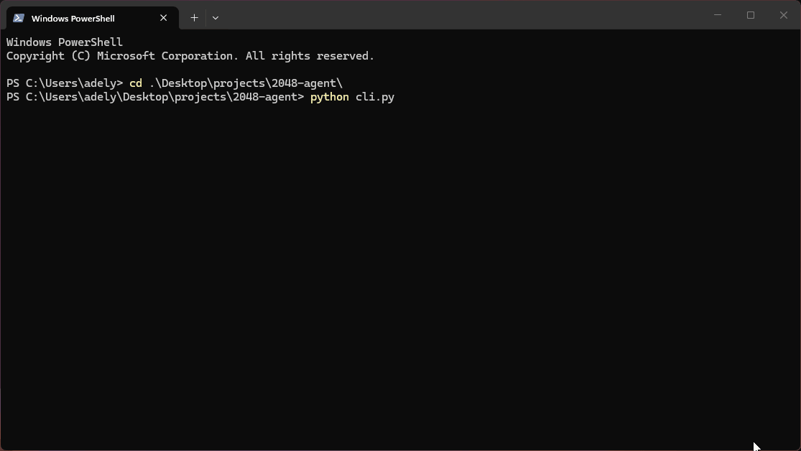

# 2048 Agent

Expectimax bot that plays 2048, with a Gemini agent stepping in at milestone tiles (after 128) to actually choose the next move using its own reasoning instead of letting the search bot decide blindly.



## How it works

**Board engine**: standard 2048 rules. All 4 directions come from one merge function, reused via reverse and transpose tricks instead of writing four separate implementations.

**Heuristics**: empty cell count, monotonicity, smoothness, corner weight. Combined into a weighted score the search uses to judge a board.

**Search**: expectimax at a fixed depth. Max node tries each legal move, chance node averages over where the next tile spawns (90% a 2, 10% a 4).

**Agent**: at milestone tiles (128, 256, 512, 1024, 2048) a Gemini agent takes over for one move. It gets two tools, `get_valid_moves` and `evaluate_board`, and picks a direction through its own reasoning rather than a hardcoded rule. Falls back to the search bot if its answer can't be parsed.

**Demo**: `cli.py` renders the board and prints the agent's reasoning at each milestone with a short pause, made to be screen recorded.

## Benchmark

38% win rate, ~1332 average max tile over 25 games at depth 3.

I tried tuning the heuristic weights with hill climbing (`tune.py`), twice, at two different sample sizes. Both runs found weights that scored better on their own small sample, but both performed worse than the original weights once validated on a bigger benchmark. Kept the original weights.

## Running it locally

```bash
git clone https://github.com/Lun4R-420/2048-agent.git
cd 2048-agent
pip install -r requirements.txt
```

Get a key at [Google AI Studio](https://aistudio.google.com/apikey) and paste into a .env file in the project root with:

```bash
GOOGLE_API_KEY=your_google_key
```

Then run any of the scripts:

```bash
python cli.py
python benchmark.py
```
